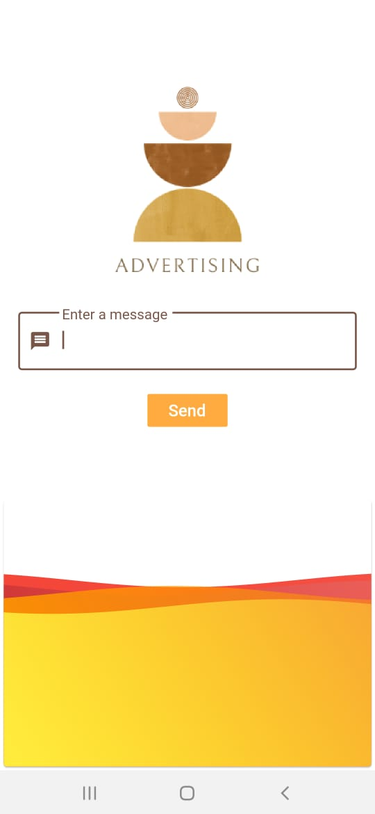
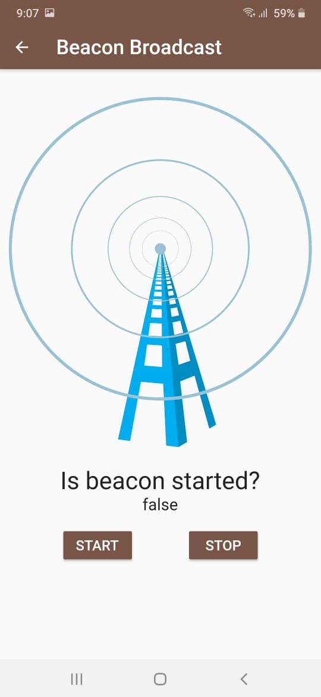

# Proximity Marketing App- Beaconer
>This project focuses on proximity marketing, enhancing the marketing capabilities and reach of merchants by displaying relevant promos, new launches, and other information on any product or service.
### This project is based on:
* Flutter based app using Beacon:  The merchant’s variant of the app will continuously transmit data packets using beacon and any smartphone passing nearby will detect the data packets and display the promotion, service etc.  Multiple smartphones will be able to display the promotions at the same time. Promotions will be fetched continuously from a cloud database.
## Tech Stack:
	  	

### Problem Statement:
* Proximity marketing of products/services of any category.
* Storage of promotions, which can be maintained easily over cloud database.
* Can help in analysing products and promotions which are more attractive in consumer market.

## About the Application

### Home Screen
* The screenshot shown below is the Home Page of the Merchant's App. 
* Merchant will enter an advertisement message in the text field.  
* Merchant can save it for sending the message when needed .  
* 

### Control Screen
* The screenshot shown below  is basically the control Screen. 
* This Screen appears after Home Screen.  
* Merchant can start and stop transmitting the beacon.  
* When the merchant starts the transmission users start getting the advertisement messages of the shop's merchant nearby them. 
* 

## Project setup
### For setting up project in local PC
1. Make sure you have got flutter (including the command line tool) and Android Studio installed.
2. Open Android Studio and select 'Import from version control' and enter the repo's git url.
3. Navigate to any file which shows 'Missing class' errors, and click on the 'Get dependencies' button
   on the yellow ribbon at the top.

The repo's codebase is now setup on your local machine, and you can make changes to it and push them to the git repo.
